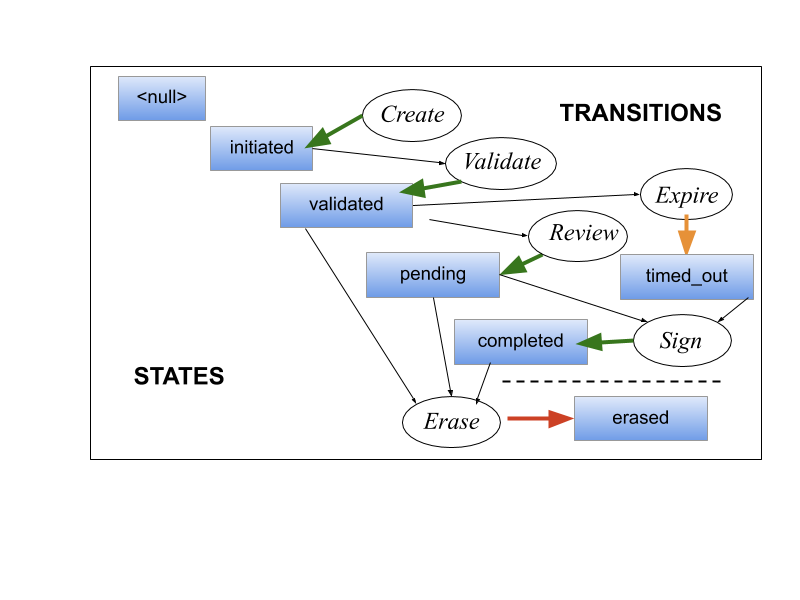
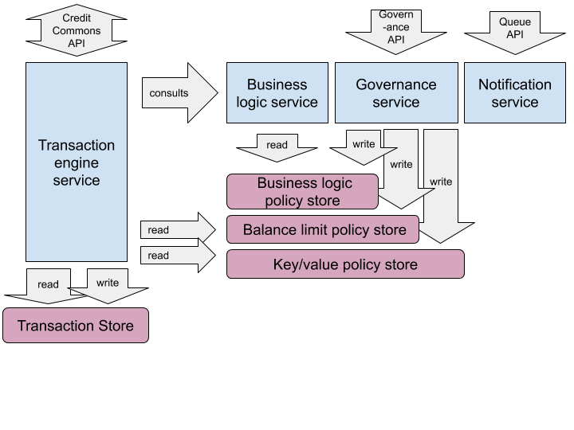

# The Credit Commons Stack

Elsewhere we describe the fundamental requirements for an instantiation of the [Credit Commons Protocol](Accounting_TradeEngine_Fundamentals.md) - a tree of nested ledgers, built and interacting on the basis of the Protocol, forming a globally scalable exchange network of trust-scale networks.

Here, we outline architecture of this reference implementation as a stack of interacting microservices and API calls.

The implementation design has been developed in the context of social and governance considerations which are not included in the Protocol document. These are not made explicit here - or anywhere, as yet; this work needs to be undertaken.

The result is a more complete system, a stack of microservices which work together to provide accounting and other services to a community in respect of accounting for value exchange. This implementation is not intended as, but can be deployed as a full application in itself. Normally a credit commons node would be a component of a larger trading or social networking platform, providing a richer trading or community experience than bare accounting. That is why this reference implementation contains only the bare minimum of authentication code and access control.

[Outline of the Transaction process](#outline-of-the-transaction-process)

 - [Workflow](#workflow)

 - [Initiating a transaction](#create-initiate-a-transaction)

 - [Build & Validate - making sure a transaction is possible, and appending any relevant fees](#build-validate-phase)

 - [Approval - ask the Creator to 'press go' for the Transaction as Validated](#approval-phase)

 - [Changing state, and workflow](#workflow-transitions)

 - [Example of transaction replication](#example-of-transaction replication)

[Microservice architecture](#microservice-architecture)

- [Authentication](#authentication)

[Future Implementation](#future-implementation)

- [Growing the Tree](#growing-the-tree)

- [Governance service](#governance-service)

   - [Governance service API calls](#governance-service-api-calls)

## Outline of the Transaction process

The system allows for accounting records - [Transactions](Accounting_TradeEngine_Fundamentals.md#transactions) - to be created in appropriate [Nodes](Accounting_TradeEngine_Fundamentals.md#nodes), within an arbitrarily large [Tree](Accounting_TradeEngine_Fundamentals.md#tree-of-ledgers) of nodes. Transactions exist somewhere along a given workflow path

### Workflow

A Transaction always exists in one of a number of states. The core workflow consists of defined transitions between these states.

The states and transitions involved in the two provided workflows are as follows

(state: **bold**, transition, *italic*):

null > *Create* > **initiated** > *Validate* > **validated** > *Review* > **pending** > *Sign* > **completed**

Two additional states are required to allow for Timeout and Reversal of a Transaction.

**Validated**/**Pending**/**Completed** > *Erase* > **erased**

**Validated**/**Pending**/**Completed** > *Expire* > **timed_out**

### Create - initiate a Transaction

A new Transaction is initiated when a client authenticated as a local account sends the five transaction fields (payer, payee, quant, description, type) to the ledger microservice 'build' endpoint. The node appends any fees and relays the transaction to other nodes using the buildrelay endpoint.

the transaction author is the account on the local node from which the transaction came. If the author is a remote node, that account is called the $upstreamAccount. If the other account is remote, it would be the $downstreamAccount. The ledger object varies according to whether the upstream and downstream accounts exist, and is called 'Ledger' (both local), intermediateLedger (both remote), or StartLedger or EndLedger.

### Build/Validate phase
Trnsaction Entries are categorised as **Main**, which is the one originally passed by the client, or as **Additional**, which means it was added automatically. Not all entries in a transversal transaction are written to all nodes.
The transaction is passed to the business logic service which returns any additional entries to be appended. Entries can involve either the upstream or downstream account.

The transaction including only non-local entries is then passed downstream, and any new entries are received back, already validated by every node downstream. The node then validates the transaction, with all its entries, writes the validated transaction to the temp file and passes back upstream any new entries which involve the upstream account.

### Approval phase
If the client is upstream, the whole transaction is returned to the client, along with the actions, appended by the workflow class.
The client, having seen all the dependent transactions, clicks a confirm button, and the first workflow state change is relayed accross the ledger. The most remote node writes the transaction first, adding it to the hash chain, and so on back upstream until the client sees that the transaction is in, say, the 'pending' state, awaiting the payee's approval.

### Change State - workflow transitions.
Whenever the transaction is returned to a client for display, any workflow transitions that that account may perform on the transaction are passed along with the transaction for the client to render as a button or link.

When a transaction changes its workflow state, the headers are rewritten in the transaction table but the entries in the entries table remain unchanged. The hashchain is then updated.

## Example of transaction replication.
In the following example, a transaction replicates accross 3 ledgers child1, parent, and child2, with each ledger adding a fee (into its fees account) for each party to the transaction. The original entry and two for each ledger are numbered 1-7. Two entries, (numbered 3 and 6) are local to their own child ledger. Notice how the names of the parties to the transaction change on each ledger.

### parent/child1/alice pays parent/child2/bob

#### child1
  - 1 +alice -> BoT (primary transaction)
  - 2 +parent -> fees (child1 tax on bob)
  - 3 +Alice -> fees (child1 tax on alice) LOCAL

#### parent
  - 1 child1 -> child 2
  - 2 Child2 -> child 1
  - 4 +Child 2 -> fees (parent tax on bob)
  - 5 +child 1 -> fees (parent tax on alice)

#### child2
  - 1 BoT -> bob
  - 2 bob -> BoT
  - 4 bob -> BoT
  - 6 +bob -> fees (child2 tax on bob) LOCAL
  - 7 +BoT -> fees (Child2 tax on alice)

#### parent
  - 1 child1 -> child 2
  - 2 Child2 -> child 1
  - 4 Child 2 -> fees
  - 5 child 1 -> fees
  - 7 Child1 -> child 2

####child1
  - 1 alice -> BoT
  - 2 BoT -> fees
  - 3 Alice -> fees
  - 5 Alice -> BoT
  - 7 BoT -> fees

Note that every ledger ONLY responds to the 1st transaction - cascading fees are not allowed because the build phase could potentially never finish! Not all entries are visible on all ledgers. The parent tax on child2 is not visible on child1 and the child1 tax on alice is not visible to any other ledger.

## Microservice architecture

In this reference implementation, a node is comprised of three microservices: `ledger`, `policy`, `blogic`, `workflowedit`, each on its own subdomain. The ledger microservice is what defines the Credit Commons protocol, the others merely support it. The microservices architecture was chosen not so much for performance, but for modularity.
 It is intended for implementers to pick and choose components, to reduce the difficulty of integration and enable more sharing of components.

Each service has config stored as key/value pairs, and a simple API method for modifying it. The microservices are:

- A ledger service, which connects to clients and other ledgers via the Credit Commons API, reading, writing, and validating transactions, and handling workflow.

- A business logic service, which appends entries to a transaction. Currently this is implemented as a simple logical script. Another approach would be to design a format which encompassed all possible logic, then a seperate service wouldn't be needed.

- Policy store, which handles account names, balance limits and remote urls of accounts.

More are under consideration.

- Notification queue service

- Governance service which handles deliberation and config changes

- Transaction storage service would make it easier to integrate with different backends, such as blockchains.

(This diagram is too out of date.)

### Authentication

Normally a user would be authenticated by their social network and the social networking app would make requests to the Credit Commons Service with a header containing proof of authentication. The policy microservice is used to check that an account exists and is active.

Currently a user called -admin- is allowed by the workflow service because there is no other way to mark accounts with administrative access.

## Future Implementation

### Growing the Tree

A server level script is needed to create connected child ledgers. The procedure would involve:
- adding a url to an account
- copying the code for a node, and setting up a database for the new node.
- providing an opportunity to edit the new node's configuration
- creating a new BoT account on the node node
- creating a new account for the user whose account was just converted, and a new login.
- initiating a new hashchain

### Time window for approval
Before the transaction is approved it can be deleted entirely. the ledgers need to agree how long the transaction will be kept if not approved before being cleaned up.
This is necessary because there may be some time delay after Validation before a human user completes the Review. Balances and transactions fees might change during this period - which could either invalidate the Transaction or change its cost. The Creator needs to be given a period of confidence as to both of these. Each Ledger will publish a Time Window number in milliseconds.

### HTTP Timeout
Since very remote transactions may have to traverse many ledgers, the timeouts should be determined sensitively. More local operations would be expected to happen more quickly.

### Governance service

This service determines and writes policy. It supports whatever human processes are needed for deliberation, voting, etc. The client would connect to this service to propose policy changes, and vote. We can't build this in MVP and policies will run as php scripts directly on endpoints.

### Next version
The current implementation attempts to process each transaction in a single request/response cycle, and could get into a mess if any server was down, especially with the hash chain.

The next version needs to separate the request and response into separate calls, to be surer that all messages were received, and to ensure that transactions are written in the correct order, which is critical once there is a significant volume of traffic.
